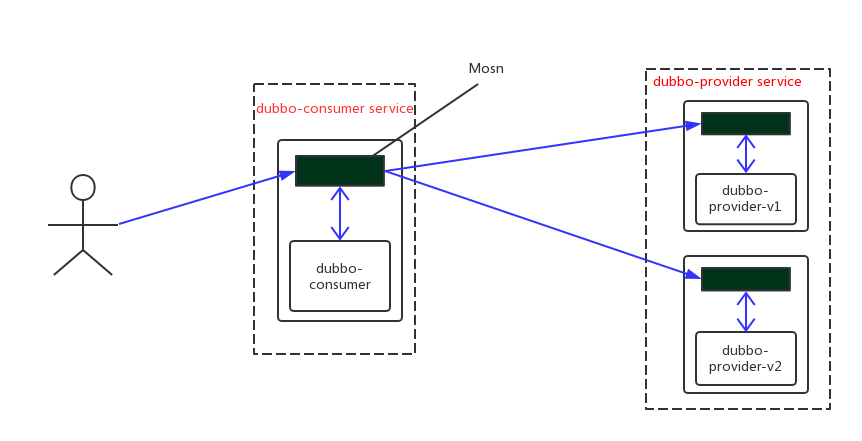

# SOFAMesh中运行Dubbo on x-protocol

 **注意：本书中的 Service Mesh 章节已不再维护，请转到 [istio-handbook](https://www.servicemesher.com/istio-handbook) 中浏览。**

原文作者：彭泽文，阿里巴巴UC事业部高级开发工程师，有改动。

X-protocol 的定位是云原生、高性能、低侵入性的通用 Service Mesh 落地方案，依托 Kubernetes 基座，利用其原生的服务注册和服务发现机制，支持各种私有 RPC 协议低成本、易扩展的接入，快速享受 Service Mesh 所带来的红利。

本文将以 [Dubbo](https://dubbo.incubator.apache.org/) 为例，演示 Dubbo on x-protocol 场景下 Service Mesh 路由功能，涵盖 Version route 、Weighted route 功能。

关于 x-protocol 的介绍请参考 [蚂蚁金服开源的 SOFAMesh 的通用协议扩展解析](http://www.servicemesher.com/blog/ant-financial-sofamesh-common-protocol-extension/)。

## 前期准备

1. 部署 Kubernetes 集群，建议使用 https://github.com/rootsongjc/kubernetes-vagrant-centos-cluster
2. 安装 kubectl 命令行工具，请参考 [https://kubernetes.io/docs/tasks/tools/install-kubectl/#install-kubectl](https://kubernetes.io/docs/tasks/tools/install-kubectl/#install-kubectl)
3. 安装 VM Driver，推荐安装 Virtual Box、Mac 用户也可以选择 hyperkit
4. 了解 Istio Traffic Management 相关概念

## 部署

先看部署效果图：



本示例中dubbo-consumer的部署方式采用直连模式，即不走注册中心，完全依托kubernetes平台提供的服务注册及服务发现能力。

### 1. 安装 Kubernetes

安装 kubectl 命令行工具
推荐使用 Kubernetes 1.10 版本，并使用合适的 VM Driver，推荐使用默认的 VirtualBox。

```bash
minikube start --memory=8192 --cpus=4 --kubernetes-version=v1.10.0 \
    --extra-config=controller-manager.cluster-signing-cert-file="/var/lib/localkube/certs/ca.crt" \
    --extra-config=controller-manager.cluster-signing-key-file="/var/lib/localkube/certs/ca.key"
```

Mac OSX 用户使用的 hyperkit 需要特别指定：

```bash
minikube start --memory=8192 --cpus=4 --kubernetes-version=v1.10.0 \
    --extra-config=controller-manager.cluster-signing-cert-file="/var/lib/localkube/certs/ca.crt" \
    --extra-config=controller-manager.cluster-signing-key-file="/var/lib/localkube/certs/ca.key" \
    --vm-dirver=hyperkit
```

等待 Kubernetes 启动完毕，通过 kubectl 命令检查

```bash
kubectl get pods --namespace=kube-system
```

### 2. 部署 SOFAMesh

本示例演示从源代码的 master 分支直接安装最新的 SOFAMesh，安装过程使用 Helm 完成。

从 GitHub 拉取最新代码：

```bash
git clone https://github.com/sofastack/sofa-mesh.git
cd sofa-mesh
```

创建 SOFAMesh 需要的 CRD：

```bash
kubectl apply -f install/kubernetes/helm/istio/templates/crds.yaml
kubectl apply -f install/kubernetes/helm/istio/charts/certmanager/templates/crds.yaml
```

使用 Helm 安装 SOFAMesh：

```bash
kubectl apply -f install/kubernetes/helm/helm-service-account.yaml
helm init --service-account tiller
helm install install/kubernetes/helm/istio --name istio --namespace istio-system
```

安装 istioctl 命令行工具：

```bash
# 使用 make 工具安装 istioctl
make istioctl-install
```

### 3. 创建示例的命名空间

以下示例都将运行在 e2e-dubbo 命名空间下，如无 e2e-dubbo 命名空间，需先创建该命名空间：

```bash
kubectl apply -f samples/e2e-dubbo/platform/kube/e2e-dubbo-ns.yaml
```

### 4. 注入 SOFAMosn

部署 dubbo-consumer 和 dubbo-provider，部署前需要先使用 istioctl 进行 sidecar 注入，以下示例采用手动注入方式，也可以通过 istio namespace inject 功能来自动注入。

```bash
# mosn sidecar inject and deploy
kubectl apply -f <(istioctl kube-inject -f samples/e2e-dubbo/platform/kube/dubbo-consumer.yaml)
kubectl apply -f <(istioctl kube-inject -f samples/e2e-dubbo/platform/kube/dubbo-provider-v1.yaml)
kubectl apply -f <(istioctl kube-inject -f samples/e2e-dubbo/platform/kube/dubbo-provider-v2.yaml)
```

### 5. 部署示例应用

部署 dubbo consumer service 及 dubbo provider service。

```bash
# http service for dubbo consumer
kubectl apply -f samples/e2e-dubbo/platform/kube/dubbo-consumer-service.yaml

# dubbo provider service
kubectl apply -f samples/e2e-dubbo/platform/kube/dubbo-provider-service.yaml
```

检查部署状态：

```bash
#kubectl get pods -n e2e-dubbo
NAME                                     READY     STATUS    RESTARTS   AGE
e2e-dubbo-consumer-589d8c465d-cp7cx      2/2       Running   0          13s
e2e-dubbo-provider-v1-649d7cff94-52gfd   2/2       Running   0          13s
e2e-dubbo-provider-v2-5f7d5ff648-m6c45   2/2       Running   0          13s

#kubectl get svc -n e2e-dubbo    
NAME                 TYPE        CLUSTER-IP      EXTERNAL-IP   PORT(S)     AGE
e2e-dubbo-consumer   ClusterIP   192.168.1.7     <none>        8080/TCP    10s
e2e-dubbo-provider   ClusterIP   192.168.1.62    <none>        12345/TCP   10s
```

e2e-dubbo-consumer 是一个 Dubbo 客户端应用，它暴露了一个 8080 端口的 HTTP 服务，方便我们进行验证，e2e-dubbo-provider 是一个 Dubbo 应用。
当 e2e-dubbo-consumer 通过 12345 端口调用 e2e-dubbo-provider 时，流量会被 IPtable 规则拦截，导流给 SOFAMosn。

## 验证路由能力

本示例将验证 Version route 和 Weighted route 能力。

### 1. 验证 Version Route 能力

本例将演示控制 dubbo-consumer的所有请求指向 dubo-provider-v1
配置DestinationRule: 

```bash
istioctl create -f samples/e2e-dubbo/platform/kube/dubbo-consumer.destinationrule.yaml
```

`dubbo-consumer.destinationrule.yaml` 内容如下：

```yaml
apiVersion: networking.istio.io/v1alpha3
kind: DestinationRule
metadata:
  name: e2e-dubbo-provider
  namespace: e2e-dubbo
spec:
  host: e2e-dubbo-provider
  subsets:
  - name: v1
    labels:
      ver: v1
  - name: v2
    labels:
      ver: v2 
```

配置VirtualService：

```bash
istioctl create -f samples/e2e-dubbo/platform/kube/dubbo-consumer.version.vs.yaml
```

`dubbo-consumer.version.vs.yaml` 内容如下：

```yaml
apiVersion: networking.istio.io/v1alpha3
kind: VirtualService
metadata:
  name: e2e-dubbo-provider
  namespace: e2e-dubbo
spec:
  hosts:
    - e2e-dubbo-provider
  http:
  - route:
    - destination:
        host: e2e-dubbo-provider
        subset: v1
```

路由策略已经生效，可以 http 请求 dubbo consumer 来触发 rpc 请求观察效果，由于使用 Minikube 的关系，需要启动一个 Pod 用来测试

```bash
# 启动一个 busybox Pod 并登陆
kubectl run -i -t busybox --image=yauritux/busybox-curl --restart=Never
# 使用 e2e-dubbo-consumer 的域名访问服务
curl e2e-dubbo-consumer.e2e-dubbo.svc.cluster.local:8080/sayHello?name=dubbo-mosn
```

清理路由策略：

```bash
istioctl delete -f samples/e2e-dubbo/platform/kube/dubbo-consumer.destinationrule.yaml
istioctl delete -f samples/e2e-dubbo/platform/kube/dubbo-consumer.version.vs.yaml
```

退出 Minikube shell

### 2. 验证 Weight Route 能力

本例将演示控制 dubbo-consumer 的请求指向 dubo-provider-v1，dubo-provider-v2。并控制流量分配比例为 v1：20%，v2：80%。

配置DestinationRule: 

```bash
# 如果在上一示例中已经创建好了，请跳过这一步
istioctl create -f samples/e2e-dubbo/platform/kube/dubbo-consumer.destinationrule.yaml
```

`dubbo-consumer.destinationrule.yaml` 内容如下：

```yaml
apiVersion: networking.istio.io/v1alpha3
kind: DestinationRule
metadata:
  name: e2e-dubbo-provider
  namespace: e2e-dubbo
spec:
  host: e2e-dubbo-provider
  subsets:
  - name: v1
    labels:
      ver: v1
  - name: v2
    labels:
      ver: v2 
```

配置 VirtualService：

```bash
istioctl create -f samples/e2e-dubbo/platform/kube/dubbo-consumer.weight.vs.yaml
```

`dubbo-consumer.weight.vs.yaml` 内容如下：

```yaml
apiVersion: networking.istio.io/v1alpha3
kind: VirtualService
metadata:
  name: e2e-dubbo-provider
  namespace: e2e-dubbo
spec:
  hosts:
    - e2e-dubbo-provider
  http:
  - route:
    - destination:
        host: e2e-dubbo-provider
        subset: v1
        weight: 20
    - destination:
        host: e2e-dubbo-provider
        subset: v2
        weight: 80
```

路由策略已经生效，可以 http 请求 dubbo consumer 来触发 rpc 请求观察效果：

```bash
# 启动一个 busybox Pod 并登陆
kubectl run -i -t busybox --image=yauritux/busybox-curl --restart=Never
# 使用 e2e-dubbo-consumer 的域名访问服务
curl e2e-dubbo-consumer.e2e-dubbo.svc.cluster.local:8080/sayHello?name=dubbo-mosn
```

清理路由策略：

```bash
istioctl delete -f samples/e2e-dubbo/platform/kube/dubbo-consumer.destinationrule.yaml
istioctl delete -f samples/e2e-dubbo/platform/kube/dubbo-consumer.weight.vs.yaml
```

SOFAMesh Github 地址：https://github.com/sofastack/sofa-mesh

## 参考文档

- [蚂蚁金服开源的 SOFAMesh 的通用协议扩展解析 - servicemesher.com](http://www.servicemesher.com/blog/ant-financial-sofamesh-common-protocol-extension/)
- [Dubbo quick start - dubbo.incubator.apache.org](https://dubbo.incubator.apache.org/en-us/docs/user/quick-start.html)

- 关于SOFAMesh的更多信息请访问 https://www.sofastack.tech
